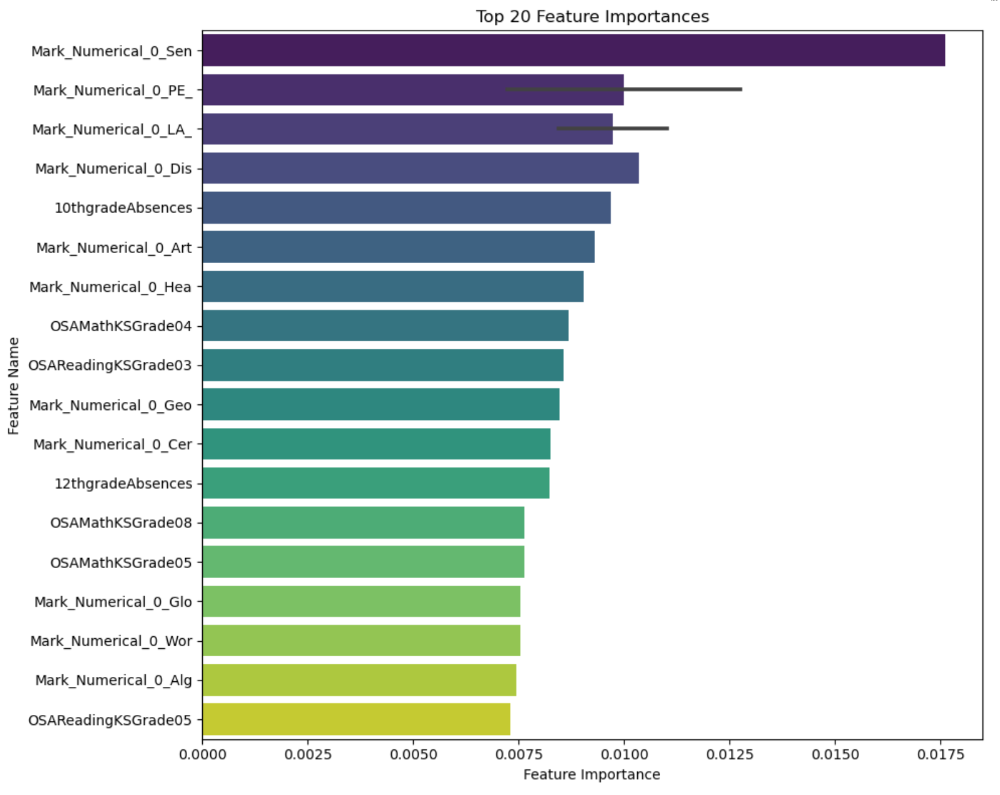
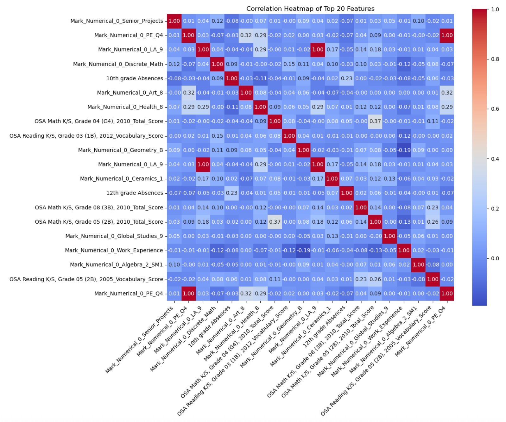

# High School Graduation Prediction Project

This project analyzes factors influencing on-time high school graduation and
regular attendance using machine learning. It is designed as a practical example of how a school district might build an early-warning system to identify students who may need additional support.

🔗 For more information, you can read my full blog write-up on [Random Forests for the Trees](https://randomforestforthetrees.medium.com/from-student-learning-to-machine-learning-predicting-high-school-graduation-with-data-318497426015).

📑 Additionally, you can download the full project presentation [here](https://github.com/mtchynkstff/high-school-graduation/blob/main/reports/Plymouth-HS_Data-Analysis_013025.pdf).


---

## 📁 Repository Structure

```text
data/                    # synthetic or local student-level dataset (not tracked)
notebooks/               # main analysis notebook
reports/
  figures/               # exported charts for README & slides
  Plymouth_Graduation_Project_Presentation.pdf   # slide deck (de-identified)
src/                     # helper scripts (e.g., synthetic data generator)
requirements.txt         # dependencies
README.md                # project documentation
```

---

## 🚀 How to Run

Install dependencies:

```bash
pip install -r requirements.txt
```

Generate synthetic data:

```bash
python src/generate_synthetic.py
```

This will create:

```text
data/synthetic_graduation_data.csv
```

Then launch Jupyter:

```bash
jupyter notebook notebooks/Plymouth-Graduation-Project-Final-Clean_020325.ipynb
```

Update the notebook to point at `data/synthetic_graduation_data.csv` when running
outside your secure district environment.

---

## ▶️ Open in Google Colab

[](
https://colab.research.google.com/github/mtchynkstff/high-school-graduation/blob/main/notebooks/Plymouth-Graduation-Project-Final-Clean_020325.ipynb)

---

## 📊 Problem & Data

**Goal**

Predict whether a student will:

- Graduate on time, and
- Maintain regular attendance,

based on their historical academic, behavioral, and assessment records. The intent is
to support earlier, targeted interventions rather than to label students.

**Conceptual features**:

- GPA and course grades
- Attendance rate and absences
- Credits earned toward graduation
- Assessment scores (e.g., ELA, Math)

**Targets**:

- `on_time_graduation` (1/0)
- `regular_attendance` (1/0)

The public version of this repo uses **synthetic data** only.

---

## 🧠 Methods

The main notebook is organized into the following stages:

1. **Data import & cleaning**
2. **Exploratory data analysis (EDA)**
3. **Feature engineering**
4. **Modeling with Random Forest (and baselines)**
5. **Evaluation (ROC-AUC, precision/recall, confusion matrices)**
6. **Explainability with feature importance and SHAP**
7. **Insights, limitations, and next steps**

---

## 🖼️ Figures





---

## 🔒 Privacy

- The original project used real student data protected under FERPA.
- This public repository contains **no real student-level data**.
- Any example CSVs are synthetic and generated by `src/generate_synthetic.py`.

---

## 📌 Next Steps

- Add hyperparameter tuning and calibration.
- Add a fairness/bias evaluation section by subgroup.
- Build a simple Streamlit app using the synthetic data as a demo.

_Last updated: 2025-11-14_
